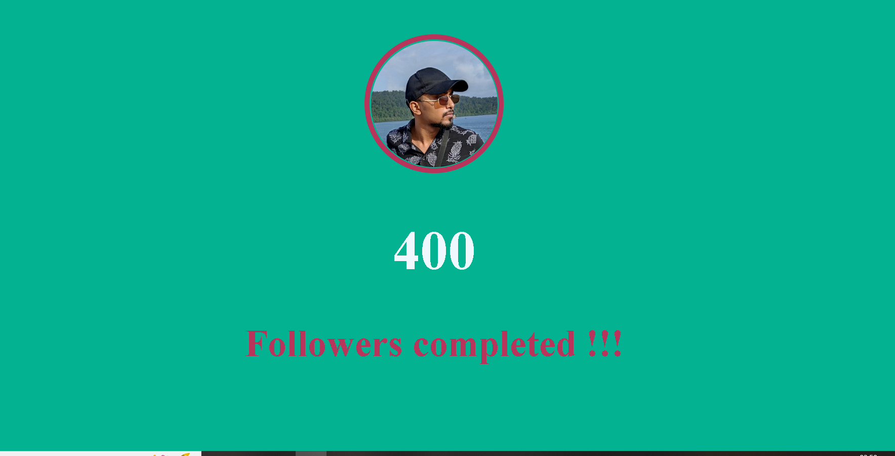

# JavaScript_Counter

# _Hello I'm AMAR_
This is a sort of mini project to display how to make a counter using javascript or how to perform changes to DOM</b> 

## What I have learn ? 

- DOM Manipulation
- setTimeout()
- setInterval()
  
## Estimated time I took to complete this
    - 20 minutes
